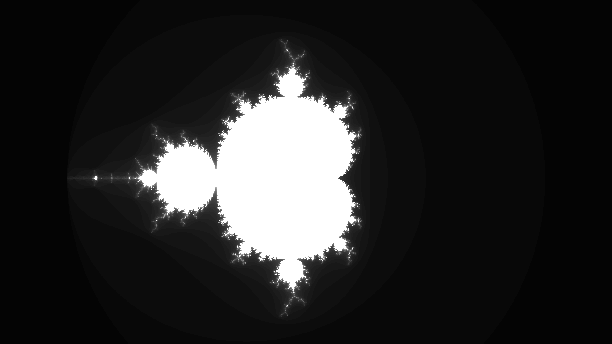

# Множество Мандельброта

Один из самых красивых математических объектов, который можно получить как множество точек для которых $Z_{n+1} = Z_n^2 + c$ задает ограниченную последовательность.
Задаче его отрисовки и оптимизации алгоритма отрисовки посвящён данный репозиторий

## Реализация алгоритма

<!-- FIXME написать что примеры ниже упрощены, написать че такое мсет и колорпиксель -->

Простейший алгоритм на C состоит из 2х функций:

```cpp
void ComputeNaive(MSet* m_set) {
    for (int y = 0; y < kWindowHight; y++) {
        float tmp_y = y - kWindowHight / 2.0f;
        for (int x = 0; x < kWindowWidth; x++) {  
            float real = (x - kWindowWidth / 2 ) * 4 
                         / kWindowAvgSide;
            float imag = tmp_y * 4 / kWindowAvgSide;
            
            uint8_t grad = CheckPixelNaive(real, imag);
            ColorPixel(m_set, grad, y * kWindowWidth + x);
        }
    }
}

uint8_t CheckPixelNaive(float real, float imag) {
    float x = 0;
    float y = 0;

    uint32_t iter = 0;

    float x_mul = 0;
    float y_mul = 0;

    while (x_mul + y_mul < 4 && iter <= kMaxIter) {
        float x_temp = x_mul - y_mul + real;
        y = 2 * x * y + imag;
        x = x_temp;

        x_mul = x * x;
        y_mul = y * y;
        iter++;
    }

    return iter % 255;
}
```

При малых значениях `kMaxIter` даёт приемлемые результаты но при значениях больше появляется необходимость оптимизации. 

## Оптимизация

Существует множество способов оптимизации, таких как распределение на несколько потоков, offload вычислений на видеокарту или использовании векторных инструкций. Использование именно третьего варианта рассмотрено далее.

### Теория

В современных процессорах существует специальный набор инструкций предназначенный для выполнения вычислений параллельно:

| расширение | первое появление                  | ширина регистра |
|------------|-----------------------------------|-----------------|
| `sse`      | Pentium III 1999г.                | 128 бит         |
| `avx`      | Sandy Bridge 2010г.               | 256 бит         |
| `avx2`     | Haswell 2013г.                    | 256 бит         | 
| `avx512`   | Xeon Phi (Knights Landing) 2016г. | 512 бит         |

Мы будем использовать расширение `avx2`, так как оно является частью большинства современных, как десктопных так и серверных, процессоров.

### Как использовать simd инструкции

Мы бы могли написать алгоритм используя ассемблер но современные компиляторы предоставляют удобную абстракцию - intrinsic functions

Для использования интринзиков достаточно сделать `#include <immintrin.h>` и передать компилятору опцию `-march=<архитектура вашего процессора>` или просто `-march=native`

### Реализация

```cpp
void ComputeSimd(MSet* m_set) {
    for (int y = 0; y < kWindowHight; y++) {
        float y_temp = (y - kWindowHight / 2) * 4 / kWindowAvgSide;
        for (int x = 0; x < kWindowWidth; x += 8) {  
            __m256 real = _mm256_set_ps(7.0f, 6.0f, 5.0f, 4.0f, 
                                        3.0f, 2.0f, 1.0f, 0.0f);
            real = _mm256_add_ps(real, 
                                _mm256_set1_ps((x - kWindowWidth / 2) * 4 / kWindowAvgSide));

            __m256 imag = _mm256_set1_ps(y_temp);

            uint64_t grad = CheckPixelSimd(real, imag);
            uint8_t grad_arr[8] __attribute__((aligned(8)));
            
            memcpy(grad_arr, &grad, sizeof(grad));

            for (int i = 0; i < 8; i++) {
               ColorPixel(m_set, grad_arr[i], y * kWindowWidth + x + i); 
            }
        }
    }
}

uint64_t CheckPixelSimd(__m256 real, __m256 imag) {
    __m256 x = _mm256_setzero_ps();
    __m256 y = _mm256_setzero_ps();

    uint32_t iter = 0;
    int check_rad = 0;
    __m256i iter_count = _mm256_setzero_si256();

    while (iter <= Mandelbrot::kMaxIter) {
        __m256 x_mul = _mm256_mul_ps(x, x);
        __m256 y_mul = _mm256_mul_ps(y, y);
        __m256 mask = _mm256_cmp_ps(_mm256_add_ps(x_mul, y_mul), 
                                    _mm256_set1_ps(4.0f), _CMP_LT_OQ);
        
        check_rad = _mm256_movemask_ps(mask);
        if (check_rad == 0) { break; }

        iter_count = _mm256_blendv_epi8(iter_count, 
                                        _mm256_add_epi32(iter_count, 
                                                         _mm256_set1_epi32(1)), 
                                        (__m256i)mask);

        __m256  tmp_flt = _mm256_add_ps(_mm256_sub_ps(x_mul, y_mul), 
                                        real);
        y = _mm256_add_ps(_mm256_mul_ps(_mm256_set1_ps(2.0f), 
                                        _mm256_mul_ps(x, y)), 
                          imag);
        x = tmp_flt;

        iter++;
    }
}
```

### Что произошло?

**Начнём с того как читать этот код**

**Типы:**

| векторный тип   | скалярный тип   |
|-----------------|-----------------|
| `__m256`        | `float`         |
| `__m256d`       | `double`        | 
| `__m256i`       | `int`           |

**Функции:**

| часть имени   | значение                                     |   
|---------------|----------------------------------------------|
| `_mm256`      | используется avx2 инструкция                 |
| `set1`        | установить одно и тоже значение              |
| `setzero`     | установить 0                                 |
| `set`         | установить в каждый элемент                  |  
| `add`         | сложить                                      |
| `mul`         | умножить                                     |
| `cmp`         | сравнить                                     |
| `movemask`    | преобразовать старшие биты элементов в маску |
| `blend`       | "перемешать" значения двух регистров         |
| `ps`          | float                                        |
| `epi<n_bits>` | int                                          |
| `pd`          | double                                       |   

Полную документацию можно найти [тут](https://www.intel.com/content/www/us/en/docs/intrinsics-guide/index.html#).

## Сравнение реализаций

### Детали

|                         |                                 |
|-------------------------|---------------------------------|
| система                 | linux fedora 39 (kernel 6.7.10) |
| CPU                     | amd ryzen 5 3500u               |
| опции компилятора       | `-O2`/`-O3` `-march=znver1`     |
| компилятор              | gcc 13.2 и clang 17.0           |
| средняя температура CPU | ~80 C                           |
| средняя частота CPU     | ~3.5 Ghz                        |
| среднее время измерения | 2 минуты                        | 

**Способ измерения:**

Время будем замерять в количестве тактов процессора как разность возвращаемых значений интринзика `__rdtsc` из `x86intrin.h`,

Вызов `__rdtsc` выглядит следующим образом:
```asm
rdtsc
shl rdx, 32
or  rax, rdx
```

на `shl` и `or` уходит 2 такта ([источник](https://uops.info/table.html)), можем этим пренебречь

### Результаты

При `-O2`:


|           | naive         | simd         |
|-----------|---------------|--------------|
| **gcc**   | $36.1 * 10^7$ | $7.5 * 10^7$ |
| **clang** | $36.8 * 10^7$ | $6.7 * 10^7$ |

При `-O3`:


|           | naive         | simd         |
|-----------|---------------|--------------|
| **gcc**   | $36.0 * 10^7$ | $7.3 * 10^7$ |
| **clang** | $36.7 * 10^7$ | $6.7 * 10^7$ |

Таким образом нам удалось увеличить производительность алгоритма от **4.9** до **5. 3** раз в зависимости от используемого компилятора.

## Проблема

Мы получили прирост в **5** раз, оставаясь при это однопоточным алгоритмом, используя **simd**, но у этого подхода есть одна проблема - переносимость. 

Что если мы захотим перейти на другую микроархитектуру, например на **arm**?  **Программа перестанет компилироваться!** В реалиях когда архитектура **x86** перестает быть единственной среди лептопов и даже серверных систем, вопрос переносимости встает достаточно остро.

## Решение

**Позволить компилятору векторизировать наш код!**

Современные компиляторы достаточно умны, чтоб векторизировать код, но всё ещё не идеальны, поэтому нам нужно им немного помочь.

Попробуем переписать наш алгоритм так, чтоб он обрабатывал по 8 пикселей с помощью массивов, изменив наивную версию:

```cpp
#define GROUP_SIZE 8

void ComputeArray(MSet* m_set) {
    float real[GROUP_SIZE] = {0};
    float imag[GROUP_SIZE] = {0};
    uint8_t grad[GROUP_SIZE] __attribute__((aligned(GROUP_SIZE))) = {0};

    for (int y = 0; y < kWindowHight; y++) {
        float tmp_y = (y - kWindowHight / 2) * 4 / kWindowAvgSide;
        for (int x = 0; x < kWindowWidth; x += GROUP_SIZE) {
            for (int i = 0; i < GROUP_SIZE; i++) {
                real[i] = (x + i - kWindowWidth / 2) * 4 / kWindowAvgSide;
                imag[i] = tmp_y;
            }

            *(uint64_t*)grad = CheckPixelArray(real, imag);
            
            for (int i = 0; i < GROUP_SIZE; i++) {
                ColorPixel(m_set, grad[i], y * kWindowWidth + x + i);
            }
        }
    }
}

uint64_t CheckPixelArray(float real[GROUP_SIZE], float imag[GROUP_SIZE]) {
    uint8_t grad[GROUP_SIZE] __attribute__((aligned(GROUP_SIZE)));

    float x[GROUP_SIZE] = {0};
    float y[GROUP_SIZE] = {0};

    uint32_t iter[GROUP_SIZE] = {0};

    float xtemp[GROUP_SIZE] = {0};
    float x_mul[GROUP_SIZE] = {0};
    float y_mul[GROUP_SIZE] = {0};

    for (int i = 0; i < GROUP_SIZE; i++) {
        while (x_mul[i] + y_mul[i] < 4 && iter[i] <= kMaxIter) {
            xtemp[i] = x_mul[i] - y_mul[i] + real[i];
            y[i] = 2 * x[i] * y[i] + imag[i];
            x[i] = xtemp[i];

            x_mul[i] = x[i] * x[i];
            y_mul[i] = y[i] * y[i];
            iter[i]++;
        }

        grad[i] = (uint8_t)(iter[i] % 255);
    }

    return *(uint64_t*)grad;
}
```
### Результаты


|           | `-O2`         | `-O3`         | 
|-----------|---------------|---------------|
| **gcc**   | $48.5 * 10^7$ | $48.3 * 10^7$ |
| **clang** | $47.1 * 10^7$ | $47.1 * 10^7$ | 

Результат оказался **хуже** наивной имплементации.
Причина проста - компилятор не смог векторизировать наш код и оверхед из-за дополнительных циклов ухудшил время.

### Почему это произошло?

Внутри цикла `for` компилятор столкнулся с циклом `while`, который содержал код, неочевидный для компилятора
Давайте сделаем его очевидным, подобно simd реализации:

```cpp
#define ALIGNE_YMM __attribute__((aligned(32)))
#define FOR_EACH_IN_GROUP for (int32_t i = 0; i < GROUP_SIZE; i++)

uint64_t CheckPixelArray(float real[GROUP_SIZE], float imag[GROUP_SIZE]) {
    float x[GROUP_SIZE] ALIGNE_YMM = {0};
    float y[GROUP_SIZE] ALIGNE_YMM = {0};

    uint32_t iter = 0;
    uint32_t iter_count[GROUP_SIZE] ALIGNE_YMM = {0};

    float x_temp[GROUP_SIZE] ALIGNE_YMM = {0};
    float x_mul[GROUP_SIZE] ALIGNE_YMM = {0};
    float y_mul[GROUP_SIZE] ALIGNE_YMM = {0};

    #pragma nounroll
    while (iter <= kMaxIter) {
        FOR_EACH_IN_GROUP x_mul[i] = x[i] * x[i];
        FOR_EACH_IN_GROUP y_mul[i] = y[i] * y[i];
        
                          int check_rad = 0;
        FOR_EACH_IN_GROUP check_rad += (x_mul[i] + y_mul[i] < 4);
                          if (check_rad == 0) { break; }
        FOR_EACH_IN_GROUP iter_count[i] += (x_mul[i] + y_mul[i] < 4);
        FOR_EACH_IN_GROUP x_temp[i] = x_mul[i] - y_mul[i] + real[i];
        FOR_EACH_IN_GROUP y[i] = 2 * x[i] * y[i] + imag[i];
        FOR_EACH_IN_GROUP x[i] = x_temp[i];
        
        iter++;
    }

    uint8_t grad[GROUP_SIZE] ALIGNE_YMM = {0};

    FOR_EACH_IN_GROUP grad[i] = (uint8_t)(iter_count[i] % 255);

    return *(uint64_t*)grad;
}
```

Получим следующию результат (llvm):

```c++
.LCPI0_0:
        .long   0x40800000                      # float 4
.LCPI0_1:
        .long   2155905153                      # 0x80808081
.LCPI0_3:
        .byte   0                               # 0x0
        .byte   4                               # 0x4
        .byte   8                               # 0x8
        .byte   12                              # 0xc
CheckPixelArray:                        # @CheckPixelArray
        vbroadcastss    ymm1, dword ptr [rip + .LCPI0_0]
        vpxor   xmm0, xmm0, xmm0
        vxorps  xmm3, xmm3, xmm3
        mov     eax, 257
        vxorps  xmm2, xmm2, xmm2
.LBB0_1:                                # =>This Inner Loop Header: Depth=1
        vmulps  ymm4, ymm3, ymm3
        vmulps  ymm5, ymm2, ymm2
        vaddps  ymm6, ymm4, ymm5
        vcmpltps        ymm6, ymm6, ymm1
        vtestps ymm6, ymm6
        je      .LBB0_3
        vaddps  ymm3, ymm3, ymm3
        vfmadd213ps     ymm2, ymm3, ymmword ptr [rsi] 
        vsubps  ymm4, ymm4, ymm5
        vaddps  ymm4, ymm4, ymmword ptr [rdi]
        vpsubd  ymm0, ymm0, ymm6
        dec     eax
        vmovaps ymm3, ymm4
        jne     .LBB0_1
.LBB0_3:
        vpbroadcastd    ymm2, dword ptr [rip + .LCPI0_1] 
        vpshufd ymm1, ymm0, 245                 
        vpbroadcastd    xmm3, dword ptr [rip + .LCPI0_3] 
        vpmuludq        ymm1, ymm1, ymm2
        vpmuludq        ymm2, ymm0, ymm2
        vpshufd ymm2, ymm2, 245                 
        vpblendd        ymm1, ymm2, ymm1, 170           
        vpsrld  ymm1, ymm1, 7
        vpaddd  ymm0, ymm0, ymm1
        vextracti128    xmm1, ymm0, 1
        vpshufb xmm0, xmm0, xmm3
        vpshufb xmm1, xmm1, xmm3
        vpunpckldq      xmm0, xmm0, xmm1       
        vmovq   rax, xmm0
        vzeroupper
        ret
```

Как мы видим компилятор смог векторизировать наш код.

### Результат


|           | `-O2`         | `-O3`         | 
|-----------|---------------|---------------|
| **gcc**   | $17.4 * 10^7$ | $23.6 * 10^7$ |
| **clang** | $11.2 * 10^7$ | $11.2 * 10^7$ | 

Таким образом нам удалось увеличить производительность алгоритма в сравнении с наивной версией от **2.1** до **3. 3** раз в зависимости от используемого компилятора.

## Итог

Мы можем достичь высокого уровня оптимизации кода без потери переносимости, для этого нам лишь нужно немного помочь компилятору.

## Contact me

naumov.vn@phystech.edu
